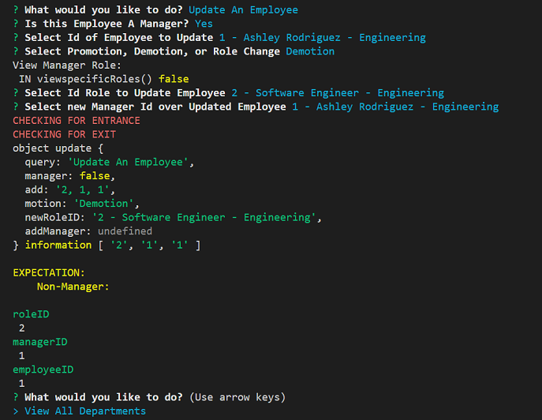

[](https://www.javascript.com)<br>
# **Employee Tracker**

## Welcome to Employee Tracker.&nbsp;&nbsp;This application is designed to store Company related information.&nbsp;&nbsp;It uses *mysql* to store information locally to the file system.&nbsp;&nbsp;It is **not** designed to keep confidential information stored such as '*passwords*', '*social security #'s*', *etc*.&nbsp;&nbsp;Please **note*:&nbsp;&nbsp;Input information can be *sensitive*.<br><br>

### **Table of contents:**

- [Getting Started](#getting)
- [Installations](#installations)
- [Setup](#setup)
- [Usage](#usage)
- [Tests](#tests)
- [Resources](#resources)
- [Location](#location)
- [License](#license)

## Getting Started:

<br>&nbsp;&nbsp;*Included with node.js installation*<br><br>First to get started, you will need to have downloaded Node.js.&nbsp;&nbsp;If you haven't, you may go here.&nbsp;&nbsp;[*node.js downloads*](https://nodejs.org/en/download/)<br>Second, you will need to have downloaded mysql.&nbsp;&nbsp;If you haven't, you may go here.&nbsp;&nbsp;[*mysql downloads*](https://www.mysql.com/downloads/)<br>

## Installations:

&nbsp;&nbsp;&nbsp;&nbsp;&nbsp;&nbsp;
  
First, you'll need to open the correct directory.<br>This can be done simply by selecting the server.js file, '*right*' click, and select '*Open in Integrated Terminal*'.<br><br>Next you'll want to type in the command line *Example 1* below.<br>This will update the package.json file to your local path directory.<br><br>Next, you will want to type in the command line *Example 2*.<br>This will install the neccessary dependancies needed that are defined in the package.json file.<br><br>Now you should see a folder *node_modules* and a file *package-lock.json*.<br>This folder contains the *packets* needed for the application to run and the lock file is the *path directory* for that folder.<br>

*Example 1:*
```shell
npm init -y
```

*Example 2:*
```shell
npm install
```

## Setup:

Now you will need to travel to the connect folder.<br>Select file *localize-db.js*.<br>Here you will need to place your *own* mysql database password in the field labeled *password*.

Also before running the application, you will need to create and seed the database through mysql.<br>On the command line type *Example 1* below.<br>Then enter your password.<br><br>Next on the command line type *Example 2* below.<br>This will create the database, tables to the database, and seed the information provided for the tables.<br><br>Now logout of mysql by typing ***Exit*** on the command line.

*Example 1:*
```shell
mysql -u root -p
```

*Example 2:*
```mysql
SOURCE db/schema.sql; SOURCE db/tables.sql; SOURCE db/seeds.sql;
```

## Usage:

Now to run the application in the command line type the *Example* below.<br>The application will '*connect to the database*',&nbsp;&nbsp;then make a '*connection to your local host*',&nbsp;&nbsp;which will in turn '*start the application process*'.

*Example:*
```shell
npm start
```

*Screenshot 1*


*Screenshot 2*


**Walkthrough video [*click here*.](https://drive.google.com/file/d/1E_d43Bk0lWKk0F_CDHimTneuFla4qcdL/view)**

## Tests:

Created self made tests to confirm information being passed before querying database.<br>Located on files themself, currently commented out.

*Example Test 1*



*Example Test 2*


## Resources:

[mysql database](https://www.mysql.com/)<br>[node.js](https://nodejs.org/en/docs/)<br>[inquirer](https://www.npmjs.com/package/inquirer?activeTab=readme)<br>[Express](https://expressjs.com/)<br>[mysql2](https://www.npmjs.com/package/mysql2)<br>[Console.table](https://nodejs.org/api/console.html#consoletabletabulardata-properties)<br>[Google](https://www.google.com)

## Location:

[Employee Tracker](https://github.com/zMag33z/week-12-Employee_Tracker)

## License:
  

  
See *Terms & Conditions* of the license [***here***](https://opensource.org/licenses/MIT).

<br>


#### [**Back to top**](#)
